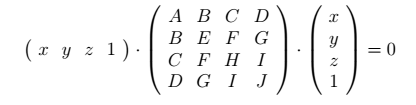
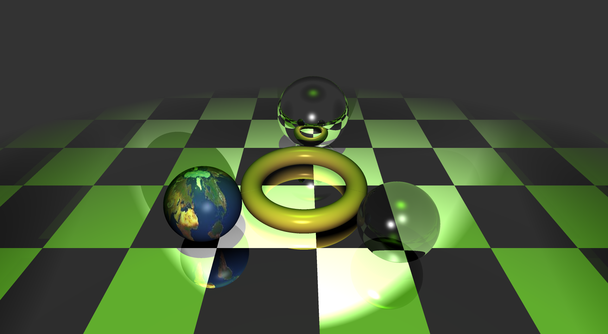

# SUM2018
Репозиторий с проектами, написанными в ходе летней практики, а также в летнем программистском лагере Computer Graphics Support Group при 
Санкт-Петербургском Губернаторском физико-математическом лицее
№30.  

Рассмотрим некоторые проекты. 

## T08RT

Система рисования фотореалистичных сцен методом трассировки лучей. Программа разбита на несколько модулей:
- [RT](https://github.com/derzhavin3016/SUM2018/tree/master/T08RT/RT) - основной модуль, отвечающий за создание и отрисовку сцены,
в свою очередь состоит из:
  - `IMAGE` - класс image. Создаёт изображение отрисованной сцены в формате `.bmp` и записывает его в файл.
  - `FRAME` - класс frame. Свзяывет всё воедино. Управляет камерой, размером окна, запускает отрисовку, а также может запускать процесс
  сохранения отрисованной сцены в формате `.bmp`.
  - `INTR` - класс, который хранит информацию о пересечении пускаемого луча с объектами сцены. 
  - `MATERIALS` - класс, который хранит информацию о материалах объектов. Материалы задают облик объекта при освещении. В данном проекте
  использовалась модель освещения Фонга, поэтому использовались следующие коэффициенты:
  ```
  ...
  // Illumination coefficients
    vec 
      Ka,              // Ambient coefficient
      Kd,              // Diffuse coefficient
      Ks,              // Specular coefficient
      Krefl,           // Reflect coefficient
      Ktrans;          // Transparency coefficient
    FLT Ph;            // Phong power coefficient
  ...
  ```
  - `SCENE` - класс, создающий сцену. Находит пересечения объектов с лучом, рассчитывает освещение, преломление и отражение луча.
  Полученное изображение отрисовывает на экране.
  - [SHAPES](https://github.com/derzhavin3016/SUM2018/tree/master/T08RT/RT/SHAPES) - база объектов. Каждый тип объекта имеет свой способ
  подсчёта пересечений с лучом и освещения. Доступны следующие типы объектов:
    - `BOX` -  параллелепипед, со сторонами, параллельными координатным плоскостям. Задаётся двумя противоположными вершинами.
    - `PLANE` - плоскость. Задаётся через нормаль и расстояние, нормаль и точку на плоскости, а также через три точки.
    - `QUAD` - поверхности второго порядка, задаются следующим уравнением:  
    ,  
    где `A`, `B`, `C`, `D`, `E`, `F`, `G`, `H`, `I`, `J` - параметрические коэффициенты поверхности.
    - `SPHERE` - сфера. Задаётся радиусом и центром.
    - `TORUS` - тор с центром в начале координат. Задаётся двумя радиусами (внешним и внутренним).
    - `TRIAN` - треугольник. Задаётся тремя точками.
    - `PRIM`  - примитив. Рассматривается как массив из треугольников.
- [WND](https://github.com/derzhavin3016/SUM2018/tree/master/T08RT/WND) - работа с окном программы, обработка событий. 
- [RES](https://github.com/derzhavin3016/SUM2018/tree/master/T08RT/RES) - дополнительные объекты:
  - [LIGHTS](https://github.com/derzhavin3016/SUM2018/tree/master/T08RT/RES/LIGHTS) - источники света. Реализованы следующие типы:
    - свет по направлению (далёкий источник)
    - точечный источник света
    - прожектор
    - отраженный свет
  - [MODS](https://github.com/derzhavin3016/SUM2018/tree/master/T08RT/RES/MODS) - модификаторы объектов. В данном проекте это текстурирование объектов разных форм.
- [MTH](https://github.com/derzhavin3016/SUM2018/tree/master/T08RT/MTH) - работа с математическими объектами:
  - `VEC` - класс работы с векторами.
  - `MATR` - класс работы с матрицами.
  - `RAY` - класс работы с лучом.
  - `SOLVE4` - решение уравнений 4 степени. Специально для нахождения пересечения с тором.
  - `CAMERA` - класс камеры.  
  
Также был добавлен простой антиалиасинг - создание изображение в четыре раза большего разрешения, затем усреднение цвета соседних четырёх пикселей.
Пример работы программы:
  

